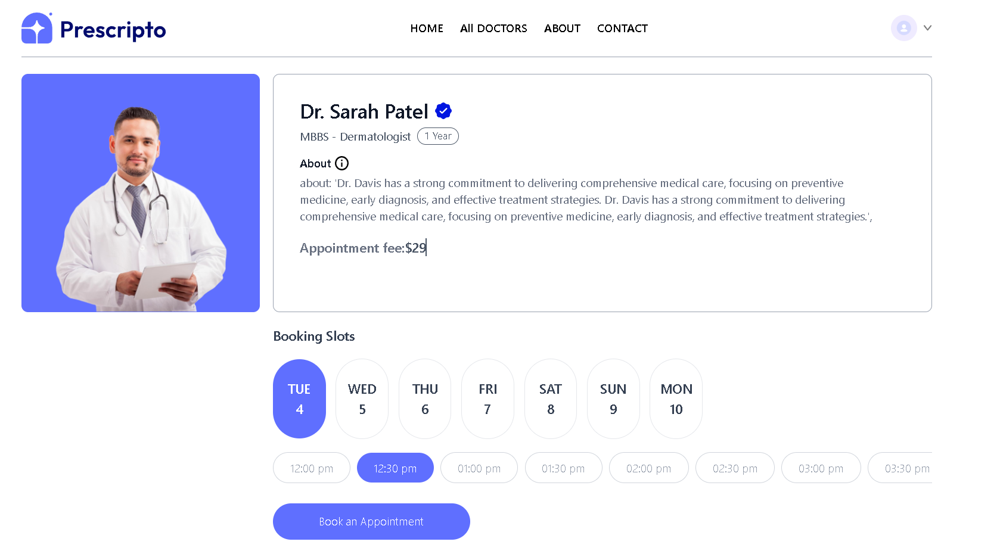
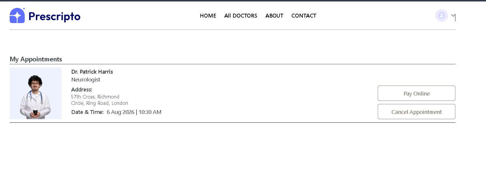
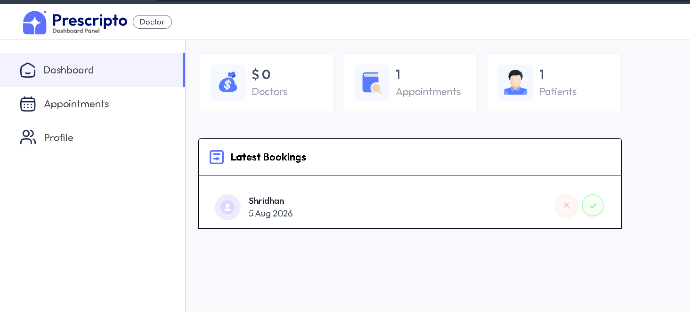
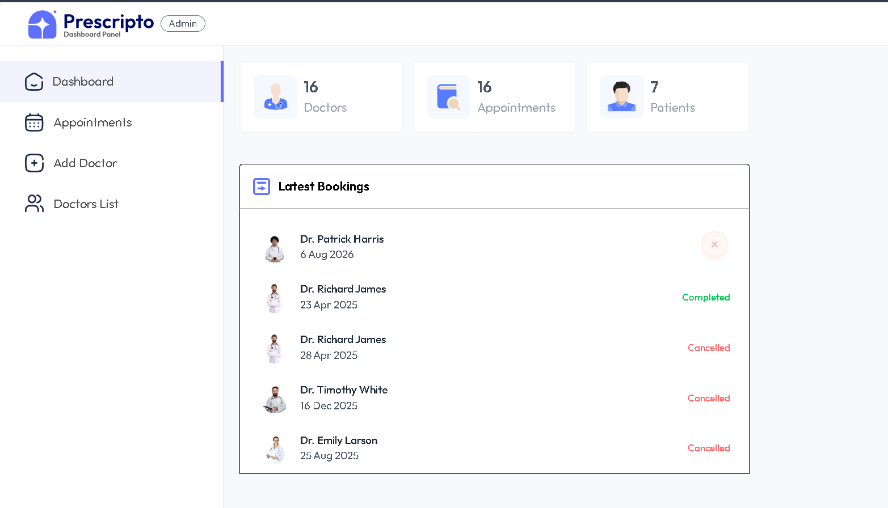
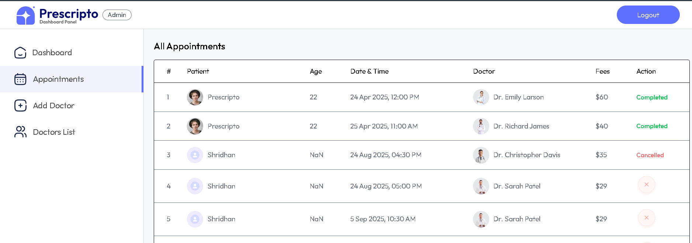

<div align="center">

# 🏥 Prescripto

### A Full-Stack Healthcare Appointment & Hospital Management Platform

Book appointments seamlessly, empower doctors to manage their schedules, and enable administrators to efficiently oversee the entire healthcare system — all from one modern web application.

<br>


<br>

### 🌐 Live Demo

https://prescripto-frontend-29f1.onrender.com/

</div>

---

# 📖 Table of Contents

- About Prescripto
- Features
- Project Modules
- Technology Stack
- Screenshots
- Project Structure
- Installation
- Environment Variables
- Running the Project
- API Overview
- Security
- Future Improvements
- Deployment
- Contributing
- License

---

# 🩺 About Prescripto

Prescripto is a **full-stack healthcare appointment and hospital management platform** designed to simplify interactions between **patients, doctors, and hospital administrators**.

The platform provides an intuitive experience for patients to discover specialists, schedule appointments based on doctor availability, securely complete online payments, and manage upcoming consultations.

Doctors receive their own dedicated dashboard where they can manage appointments, monitor earnings, update availability, and maintain their professional profiles.

Administrators have complete control over the platform through a centralized dashboard, allowing them to manage doctors, monitor appointments, oversee hospital operations, and maintain the overall healthcare ecosystem.

The project demonstrates the implementation of a scalable MERN architecture with secure authentication, payment gateway integration, cloud-based media storage, and role-based authorization.

---

# ✨ Key Features

## 👨‍⚕️ Patient Module

- Secure user authentication
- Register and Login
- Browse all available doctors
- Search doctors by speciality
- View detailed doctor profiles
- Book appointments based on available slots
- Online appointment payment using Razorpay
- Cancel appointments
- View upcoming appointments
- Appointment history
- Update personal profile

---

## 🩺 Doctor Module

Doctors have a dedicated dashboard where they can:

- Secure login
- View dashboard analytics
- Manage appointment schedule
- View patient details
- Accept and complete appointments
- Track total earnings
- Update profile information
- Manage availability status

---

## 🏥 Admin Module

The administrator has complete control over the platform.

Features include:

- Secure Admin Login
- Dashboard analytics
- View all appointments
- Manage doctors
- Add new doctors
- Enable/Disable doctor availability
- Monitor platform statistics
- View latest bookings
- Hospital management dashboard

---

# 🚀 Highlights

✔ Three Separate Dashboards

- Patient Portal
- Doctor Dashboard
- Admin Dashboard

✔ Secure Authentication

- JWT Authentication
- Protected Routes
- Role-based Authorization

✔ Payment Integration

- Razorpay Integration
- Secure Online Payments

✔ Cloud Storage

- Cloudinary Image Upload
- Doctor Profile Images

✔ Responsive Design

- Mobile Friendly
- Tablet Friendly
- Desktop Optimized

✔ Modern UI

- React
- Tailwind CSS
- Responsive Components

---

# 💻 Technology Stack

## Frontend

- React.js
- React Router DOM
- Axios
- Tailwind CSS
- Context API

---

## Backend

- Node.js
- Express.js
- JWT Authentication
- Bcrypt
- Multer

---

## Database

- MongoDB Atlas
- Mongoose ODM

---

## Cloud & Services

- Cloudinary
- Razorpay
- Render

---

# 🎯 User Roles

| Role | Access |
|------|--------|
| 👤 Patient | Book appointments, payments, profile management |
| 👨‍⚕️ Doctor | Appointment management, earnings, availability |
| 🏥 Admin | Doctors management, appointments, analytics |

---

# 📸 Application Screenshots

## 🏠 Home Page

Displays featured doctors, medical specialities, and provides quick navigation for booking appointments.


---

## 👨‍⚕️ Doctor Profile

Patients can view doctor information, experience, consultation fees, and available booking slots before scheduling an appointment.



---

## 📅 My Appointments

Users can view upcoming appointments, cancel bookings, and complete online payments.



---

## 👨‍⚕️ Doctor Dashboard

Doctors can monitor appointments, earnings, patient statistics, and recent bookings.



---

## 🏥 Admin Dashboard

Administrators can manage doctors, appointments, and monitor hospital-wide analytics.



---

## 📋 Appointments Management

Complete appointment management panel for administrators.




 
---


# 📁 Project Structure

The project is organized into three independent applications that work together.

```text
Prescripto/
│
├── admin/                 # Admin Dashboard
│   ├── public/
│   ├── src/
│   ├── package.json
│   └── ...
│
├── backend/               # Express Backend
│   ├── config/
│   ├── controllers/
│   ├── middleware/
│   ├── models/
│   ├── routes/
│   ├── uploads/
│   ├── server.js
│   └── ...
│
├── frontend/              # Patient Website
│   ├── public/
│   ├── src/
│   ├── assets/
│   ├── components/
│   ├── pages/
│   ├── context/
│   └── ...
│
├── README.md
└── package.json
```

---

# 🏗 System Architecture

```text
                        ┌─────────────────────┐
                        │     React Client    │
                        │ (Patient Frontend)  │
                        └──────────┬──────────┘
                                   │
                                   │ REST API
                                   │
                ┌──────────────────▼──────────────────┐
                │         Express.js Backend          │
                │                                     │
                │ JWT Authentication                  │
                │ Appointment Management              │
                │ Doctor Management                   │
                │ Payment Integration                 │
                └───────┬───────────────┬─────────────┘
                        │               │
                        │               │
               ┌────────▼──────┐   ┌────▼───────────┐
               │ MongoDB Atlas │   │   Cloudinary   │
               │               │   │ Image Storage  │
               └───────────────┘   └────────────────┘
                        │
                        │
                 ┌──────▼───────┐
                 │   Razorpay   │
                 │   Payments   │
                 └──────────────┘
```

---

# ⚙ Installation

Clone the repository.

```bash
git clone https://github.com/Shridhan15/Prescripto.git  
```

Move inside the project.

```bash
cd Prescripto
```

---

## Install Frontend

```bash
cd frontend
npm install
```

---

## Install Backend

```bash
cd ../Backend
npm install
```

---

## Install Admin Panel

```bash
cd ../admin
npm install
```

---

# 🔑 Environment Variables

Create a `.env` file inside the **backend** folder.

```env
PORT=4000

MONGODB_URI=

JWT_SECRET=

ADMIN_EMAIL=

ADMIN_PASSWORD=

CLOUDINARY_NAME=

CLOUDINARY_API_KEY=

CLOUDINARY_SECRET=

RAZORPAY_KEY_ID=

RAZORPAY_SECRET=

CURRENCY=USD
```

 

---

# ▶ Running the Project

### Start Backend

```bash
cd backend
npm run server
```

---

### Start Frontend

```bash
cd frontend
npm run dev
```

---

### Start Admin Panel

```bash
cd admin
npm run dev
```

---

The applications will be available at

```text
Frontend : http://localhost:5173

Backend  : http://localhost:4000

Admin    : http://localhost:5174
```

---

# 🔄 Workflow

```text
Patient
   │
   ▼
Login/Register
   │
   ▼
Browse Doctors
   │
   ▼
Select Doctor
   │
   ▼
Choose Available Slot
   │
   ▼
Book Appointment
   │
   ▼
Online Payment
   │
   ▼
Appointment Confirmed
```

---

# 🔐 Authentication Flow

```text
User Login
     │
     ▼
JWT Generated
     │
     ▼
Stored on Client
     │
     ▼
Attached to Every API Request
     │
     ▼
Backend Middleware Verification
     │
     ▼
Access Granted
```

---

# 📡 Core Functionalities

### Patient

- Register/Login
- Browse doctors
- Search by speciality
- View doctor profile
- Book appointment
- Cancel appointment
- Pay online
- View appointment history

---

### Doctor

- Login
- Dashboard
- Appointment Management
- Earnings Overview
- Availability Toggle
- Profile Update

---

### Admin

- Login
- Dashboard Analytics
- Add Doctors
- View Doctors
- Manage Appointments
- Manage Doctor Availability

---

# 📦 Major Dependencies

## Frontend

```json
React
React Router DOM
Axios
Tailwind CSS
```

---

## Backend

```json
Express
Mongoose
JWT
bcrypt
multer
cors
dotenv
validator
```

---

## Third-Party Services

| Service | Purpose |
|----------|----------|
| MongoDB Atlas | Database |
| Cloudinary | Image Hosting |
| Razorpay | Online Payments |
| Render | Deployment |

---

# 🚀 Deployment

The project has been deployed using **Render**.

### Live Application

```
https://prescripto-frontend-29f1.onrender.com/
```

The backend and admin panel are deployed separately to enable independent scaling and maintenance.

---

# 🔒 Security Features

- JWT Authentication
- Password Hashing using bcrypt
- Protected API Routes
- Role-Based Authorization
- Secure Payment Gateway Integration
- Environment Variable Protection
- Input Validation
- MongoDB Injection Prevention
- CORS Configuration

---

# 🌟 Project Highlights

Prescripto is designed with scalability, security, and user experience in mind. The application separates responsibilities across three dedicated portals, ensuring each user role has a streamlined workflow.

### ✔ Patients

- Register and securely log in
- Browse doctors by specialization
- View doctor profiles and consultation fees
- Book appointments based on availability
- Pay consultation fees online
- Cancel appointments
- View appointment history
- Manage profile information

### ✔ Doctors

- Dedicated dashboard
- View upcoming appointments
- Manage appointment status
- Track earnings
- Update profile details
- Toggle availability
- Access patient information

### ✔ Administrators

- Dedicated admin dashboard
- Add new doctors
- Manage doctor availability
- View all appointments
- Monitor platform statistics
- Manage hospital operations
- Access analytics and booking history

---

# 📈 Future Enhancements

The following features are planned for future releases.

### 🤖 AI Features

- AI-powered symptom checker
- AI chatbot for appointment assistance
- Medical report summarization
- AI-based doctor recommendation
- Intelligent appointment scheduling

---

### 📹 Telemedicine

- Video consultations using WebRTC
- Voice consultations
- Screen sharing
- Live chat between doctor and patient

---

### 📅 Appointment Improvements

- Google Calendar integration
- Email reminders
- SMS notifications
- Appointment rescheduling
- Waiting list management

---

### 💳 Payment Enhancements

- Stripe integration
- UPI support 
- Invoice generation
- Payment history dashboard

---

### 📊 Analytics

- Appointment trends
- Revenue analytics
- Doctor performance reports
- Patient statistics
- Hospital insights dashboard

---

### 🔒 Security

- Two-factor authentication (2FA)
- Rate limiting
- Audit logs
- Refresh token authentication
- Session management
- Activity tracking

---

# 🎯 Learning Outcomes

This project helped strengthen my understanding of:

- Full Stack Web Development
- REST API Design
- MongoDB Data Modeling
- Authentication using JWT
- Role-Based Authorization
- Cloudinary Integration
- Payment Gateway Integration
- Backend Architecture
- State Management in React
- Deployment using Render

---

# 🚀 Performance Optimizations

- Lazy loading components
- Optimized API requests
- Reusable React components
- Efficient MongoDB queries
- Image optimization using Cloudinary
- Modular backend architecture

---

# 🧪 Testing Checklist

### Patient

- User Registration
- Login
- Doctor Search
- Appointment Booking
- Online Payment
- Appointment Cancellation

### Doctor

- Login
- Dashboard
- Availability Toggle
- Appointment Management
- Earnings

### Admin

- Login
- Dashboard
- Add Doctor
- Manage Doctors
- View Appointments
- Analytics

---


# 📝 License

This project is licensed under the MIT License.

Feel free to use, modify, and distribute this project for educational and personal purposes.

---

# 👨‍💻 Author

## Shridhan Suman

**AI Full Stack Engineer**

- 🎓 B.Tech CSE, VIT Chennai
- 💼 Passionate about Full Stack Development, Artificial Intelligence, and Scalable Web Applications

### Connect with me

- GitHub: https://github.com/Shridhan15
- LinkedIn: https://www.linkedin.com/in/shridhan-suman-3970a3293/
- Portfolio: https://portfolio-chi-ecru-34.vercel.app/


---

<div align="center">

## ❤️ Built with MERN Stack

### Thank you for visiting Prescripto!

If you like this project, consider giving it a ⭐ on GitHub.

</div>